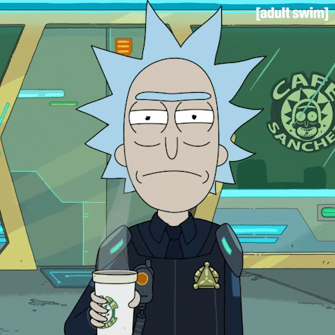

### Hello World 👋  I'm Brzane Barmaga
<!---->

- An enthusiastic artificial intelligenece engineering senior student currently enrolled in Damascus University seeking to deliver state-of-the-art AI solutions .Passionate about AI and how data-driven solutions are applied to different domains. Ranging from Industrial, Sociological and Smart City applications that positively impact people's life. 

- Seasoned and independent Front-End Developer with skill of programming to deliver an immersive and engaging user experience through efficient website development with React framework.

- Ready for challenges in order to grow professionally while contributing my best to the organization with full devotion. I believe that the skills, teamwork, and time management I attained from the environment and competitive university life define me and I am looking forward to implementing them in any opportunity I receive.
- ⚡ Fun fact: My nickname is literally translated into English as programming ("barmaga" === "programming")
---

**Languages and Skills:**
  

 

 

**Social Media:**
  

